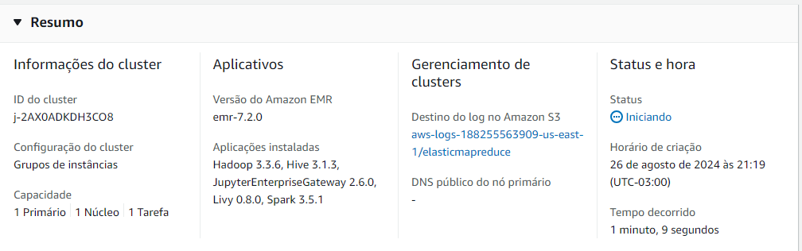

# Tutorial Amazon EMR

Bem-vindo ao tutorial sobre o Amazon EMR (Elastic MapReduce)! Neste guia, iremos guiá-lo pelos passos para configurar e usar o Amazon EMR para processamento e análise de big data.

## Tabela de Conteúdos
1. Introdução ao Amazon EMR

2. Primeiros Passos

3. Criando um Cluster EMR

4. Executando Tarefas no EMR

5. Monitoramento e Depuração

6. Dimensionando e Gerenciando 
Clusters EMR

7. Melhores Práticas

8. Conclusão

Vamos começar com o básico do Amazon EMR e como ele pode ajudá-lo a processar e analisar grandes conjuntos de dados de forma eficiente.
