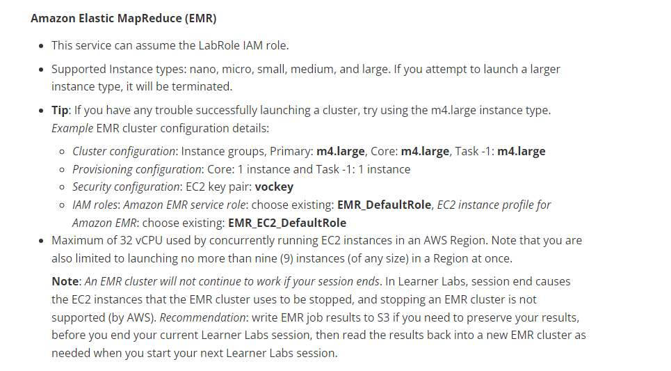

# Amazon EMR

## 1. Introdução ao Amazon EMR

A solução EMR é um recurso proposto pela AWS, que permite a execução de tarefas e gerenciamento de clusters de processamento de dados em larga escala, facilitando a análise de logs e aproveitando do poder de processamento de uma máquina em nuvem. 

## 2. Primeiros Passos

Restrições do Serviço

Existem algumas restrições que você deve estar ciente ao usar o Amazon EMR, considerando o uso de uma conta de usuário Learning Lab. É de suma importância ler e entender as restrições antes de prosseguir com o tutorial.



## 3. Criando um Cluster EMR


Nas configurações básicas, é necessário selecionar o nome do cluster, a versão do EMR e o pacote predefinido de aplicativos a serem instalados no cluster, incluindo o Hadoop, Spark, Hive, HBase, etc.

Nessa solução, são criadas duas máquinas EC2, uma para o nó mestre e outra para o nó de trabalho. O nó mestre é responsável por coordenar as tarefas do cluster, enquanto o nó de trabalho é responsável por executar as tarefas de processamento de dados.

Nos próximos passos, todas as configurações, exceto as apresentadas na aba de restrições, podem ser mantidas como padrão.

Casos todos os passos tenham sido realizados corretamente, você verá a seguinte tela:


### 3.1 Ferramentas complementares:

- [AWS CLI](https://docs.aws.amazon.com/cli/latest/userguide/install-cliv2.html)
- [AWS SDK](https://aws.amazon.com/pt/sdk-for-python/)
- [AWS S3](https://aws.amazon.com/pt/s3/)


## 4. Executando Tarefas no EMR

Para executar tarefas no Amazon EMR, é necessário importar um arquivo de dados para o Amazon S3 e, em seguida, executar um script de processamento de dados no cluster EMR.


Depois de adicionar os arquivos de dados ao S3, precisamos criar um script que realize operações em dados. O script pode ser escrito em Python, Scala, Java ou qualquer outra linguagem de programação suportada pelo Amazon EMR.

Aqui está um exemplo de script Python que conta o número de atletas brasileiros em um arquivo de atletas olímpicos:

```python

from pyspark.sql import SparkSession

if __name__ == "__main__":
    # Iniciar uma sessão Spark
    spark = SparkSession.builder.appName("ProcessCSV").getOrCreate()

    # Caminho do arquivo CSV no S3
    input_path = "s3://aws-logs-188255563909-us-east-1/athletes_new.csv"
    
    # Carregar o arquivo CSV
    df = spark.read.csv(input_path, header=True, inferSchema=True)
    
    
    # Exemplo de transformação: Filtrar atletas brasileiros na base de dados
    filtered_df = df.filter(df['country_code'] == 'BRA')

    # Salvar o resultado em outro caminho no S3
    output_path = "s3://aws-logs-188255563909-us-east-1/output/"
    filtered_df.write.csv(output_path, header=True)

    # Parar a sessão Spark
    spark.stop()

```
## 5. Monitoramento e Depuração

Para monitorar os resultados do passo executado, é possivel acessar a pasta declarada como local de output no script, verificando se o arquivo foi criado com sucesso e se o resultado esperado foi gerado.


Nesse caso, o arquivo gerado pelo log, aparentemente foi gerado seguindo a condição esperada, filtrando apenas os atletas brasileiros.

Além disso, nos casos de insucesso, é possível acessar o log do cluster para verificar possíveis erros e corrigi-los.


## 6. Próximo passo:

Realizar operações seguidas, como a utilização dos dados de um cluster para outro.
